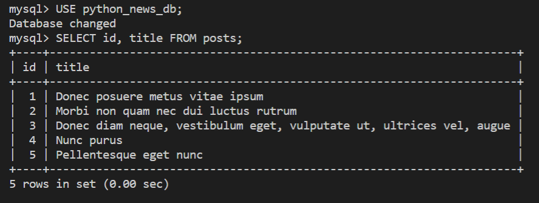

# Create a Post Model

The Just Tech News app has a one-to-many relationship between users and posts. That is, one user can create many posts. SQLAlchemy makes it easy to define that relationship, but you need to import a few more functions from the `sqlalchemy` module to make it happen.

Create the Post Module
First, create a new Post.py file in the app/models directory. In Post.py, add the following import statements:

## Create the Post Module

First, create a new `Post.py` file in the a`pp/models` directory. In `Post.py`, add the following `import` statements:

```python
from datetime import datetime
from app.db import Base
from sqlalchemy import Column, Integer, String, ForeignKey, DateTime
from sqlalchemy.orm import relationship
```

## Create the Post Class

Remember that we write SQLAlchemy models as Python classes. In the `Post.py` file, write the following class for a `Post` model:

```python
class Post(Base):
  __tablename__ = 'posts'
  id = Column(Integer, primary_key=True)
  title = Column(String(100), nullable=False)
  post_url = Column(String(100), nullable=False)
  user_id = Column(Integer, ForeignKey('users.id'))
  created_at = Column(DateTime, default=datetime.now)
  updated_at = Column(DateTime, default=datetime.now, onupdate=datetime.now)
```

Note the `user_id` field that we define as a `ForeignKey` that references the `users` table. We also add `created_at` and `updated_at` fields that use Python's built-in `datetime` module to generate the timestamps.

## Query the Post Model

When we query this model, we want to get the full information about the user who created it. Conceptualized in JavaScript Object Notation (JSON), this query will appear as follows:

```python
{
  "id": 1,
  "title": "How to Learn Python",
  "user_id": 2,
  "user": {
    "id": 2,
    "username": "lernantino"
  }
}
```

In the SQLAlchemy model, we can define dynamic properties that won't become part of the MySQL table but that the query will return.

In the `Post` class, add the following line:

```python
user = relationship('User')
```

We won't be able to observe this relationship until we start adding `SELECT` queries, but let's at least test inserting data into the `posts` table.

Revisit the `models/__init__.py` file, and add the following `import` statement:

```python
from .Post import Post
```

Then in the `seeds.py` file, update the `import` statement to include `Post`:

```python
from app.models import User, Post
```

At the end of the `seeds.py` file, add the following code before the `db.close()` statement:

```python
# insert posts
db.add_all([
  Post(title='Donec posuere metus vitae ipsum', post_url='https://buzzfeed.com/in/imperdiet/et/commodo/vulputate.png', user_id=1),
  Post(title='Morbi non quam nec dui luctus rutrum', post_url='https://nasa.gov/donec.json', user_id=1),
  Post(title='Donec diam neque, vestibulum eget, vulputate ut, ultrices vel, augue', post_url='https://europa.eu/parturient/montes/nascetur/ridiculus/mus/etiam/vel.aspx', user_id=2),
  Post(title='Nunc purus', post_url='http://desdev.cn/enim/blandit/mi.jpg', user_id=3),
  Post(title='Pellentesque eget nunc', post_url='http://google.ca/nam/nulla/integer.aspx', user_id=4)
])

db.commit()
```

It's important to run this `add_all()` method after creating the users, because the `Post` model requires valid `user_id` fields. We also need to run `db.commit()` again to confirm these latest insertions in the database.

From the command line, run `python seeds.py` or `python3 seeds.py` again. If no errors occur, you're good to go! However, it's still a good idea to verify the data from the MySQL shell. Log in to the shell and then run a `SELECT id, title FROM posts;` statement. The command line should look like the following image:



`The command line displays a posts table with id and title fields.`

With half of the models built, we're making solid progress. Next we'll build the `Comment` model.

---
© 2022 Trilogy Education Services, LLC, a 2U, Inc. brand. Confidential and Proprietary. All Rights Reserved.
